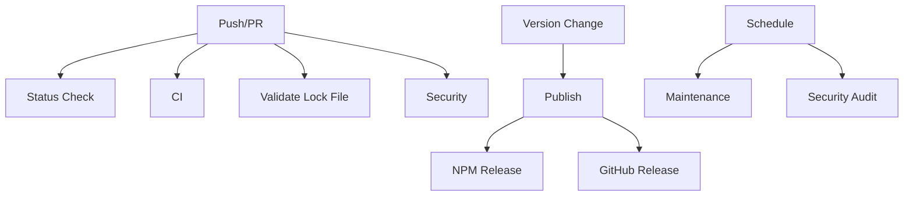

# GitHub Actions Workflows

This directory contains the CI/CD workflows for the @kareem-3del/nestjs-aramex package.

## Workflows Overview

### 🔄 CI (`ci.yml`)
**Triggers:** Push to main, Pull requests to main

Runs comprehensive testing and type checking:
- Tests on Node.js 18.x and 20.x
- Runs test suite with coverage
- Type checking with TypeScript
- Uploads coverage to Codecov
- Builds the package to ensure it compiles

### 📦 Publish (`publish.yml`)
**Triggers:** Push to main (when package.json version changes)

Automatically publishes to NPM when version is bumped:
- Detects version changes in package.json
- Runs full test suite before publishing
- Publishes to NPM with public access (for scoped packages)
- Creates GitHub release with tag

**Required Secrets:**
- `NPM_TOKEN`: NPM authentication token for publishing

### 🔒 Security (`security.yml`)
**Triggers:** Push/PR to main, Weekly schedule, Manual dispatch

Security auditing and dependency monitoring:
- Runs `npm audit` to check for vulnerabilities
- Dependency review for pull requests
- Weekly automated security scans
- Configurable severity levels

### 🧹 Maintenance (`maintenance.yml`)
**Triggers:** Daily schedule, Manual dispatch

Repository maintenance tasks:
- Automatically marks stale issues/PRs
- Closes inactive issues after grace period
- Configurable stale/close timeouts
- Respects exempt labels

### ✅ Validate Lock File (`validate-lockfile.yml`)
**Triggers:** Push/PR to main

Ensures proper dependency management:
- Validates package-lock.json exists and is committed
- Checks lock file is in sync with package.json
- Tests npm cache effectiveness
- Prevents package-lock.json from being in .gitignore

### 🎯 Status Check (`status-check.yml`)
**Triggers:** Push/PR to main

Quick validation and project health check:
- Validates project structure
- Verifies required files and directories
- Validates package.json format and required fields
- Quick build and test execution

## Dependabot Configuration

The `dependabot.yml` file configures automatic dependency updates:

- **NPM Dependencies**: Weekly updates on Mondays
- **GitHub Actions**: Weekly security updates
- Automatic assignment to repository owner
- Proper labeling and commit message formatting

## Issue Templates

### Bug Report (`ISSUE_TEMPLATE/bug_report.yml`)
Structured template for bug reports with:
- Version information collection
- Step-by-step reproduction instructions
- Log output capture
- Code of Conduct agreement

### Feature Request (`ISSUE_TEMPLATE/feature_request.yml`)
Template for feature suggestions with:
- Problem description
- Proposed solution
- Alternative considerations
- Additional context

## Pull Request Template

The `pull_request_template.md` provides:
- Change type classification
- Testing checklist
- Documentation requirements
- Breaking change documentation

## Setup Requirements

### NPM Token
To enable automatic publishing, add your NPM token as a repository secret:

1. Generate token at https://www.npmjs.com/settings/tokens
2. Add as `NPM_TOKEN` in repository secrets
3. Ensure token has publish permissions for scoped packages

### Branch Protection
Recommended branch protection rules for `main`:
- Require status checks to pass
- Require branches to be up to date
- Include status checks: "ci", "validate-lockfile", "status-check"
- Require pull request reviews

### Repository Settings
Ensure these repository settings:
- Issues enabled
- Allow merge commits
- Automatically delete head branches
- Dependabot alerts enabled

## Workflow Dependencies

## Monitoring

Monitor workflow performance through:
- GitHub Actions tab for run history
- Dependabot tab for dependency updates
- Security tab for vulnerability alerts
- Insights > Pulse for overall activity